[Advent of Code](https://adventofcode.com/) is an advent calendar of programming puzzles.
Each year two related puzzles are released on each of the first twenty-four days of December.
The second puzzle for any given day is only available after solving the first puzzle.
On December 25th there is only one puzzle and part two gives a free star if and only if you already
have 23 stars. (Or 49 through 2024)

My progress as of 2026-09-04 can be seen in the images below:

2025:

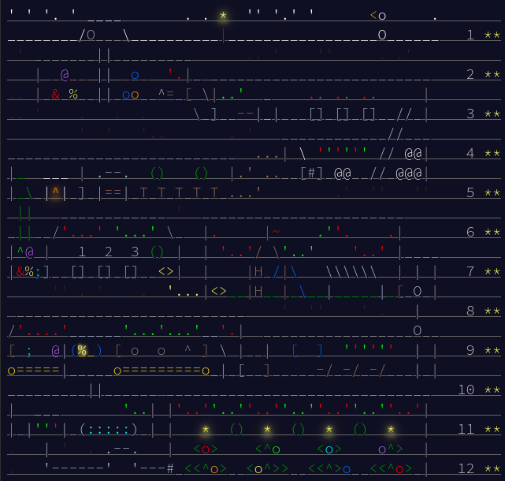

2024:

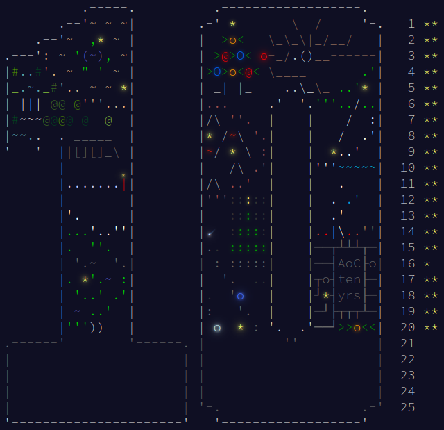

2023:

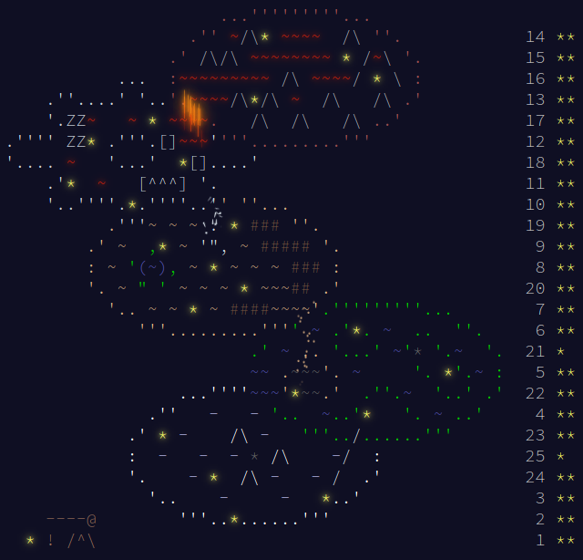

2022:

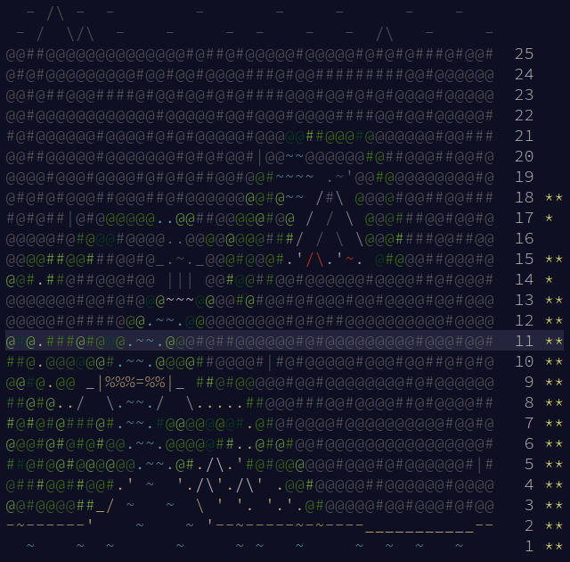

2021:

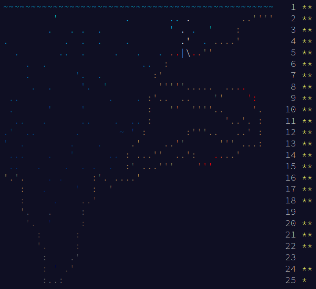

2020:

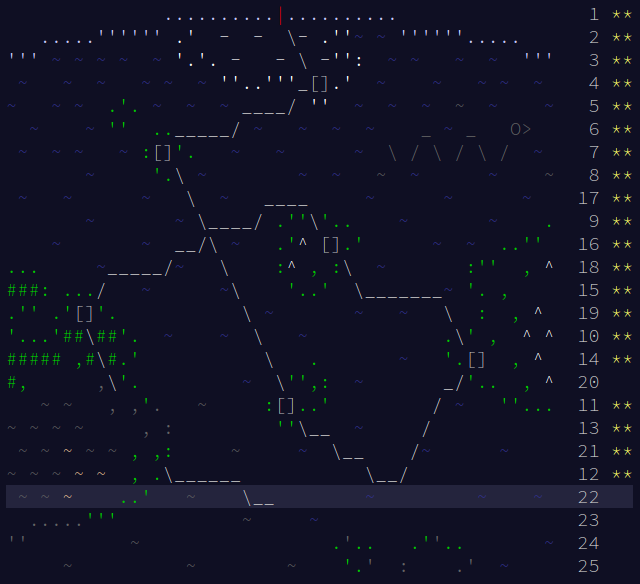

2019:

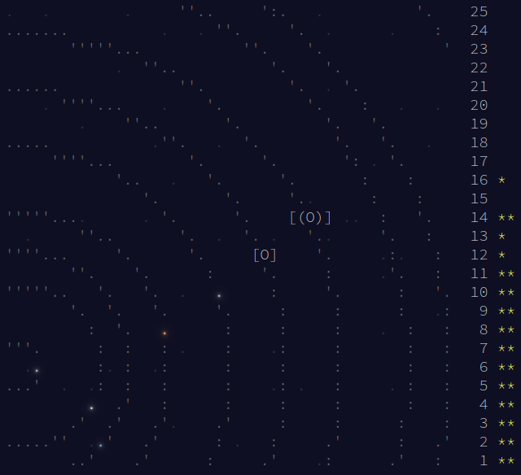

2018:

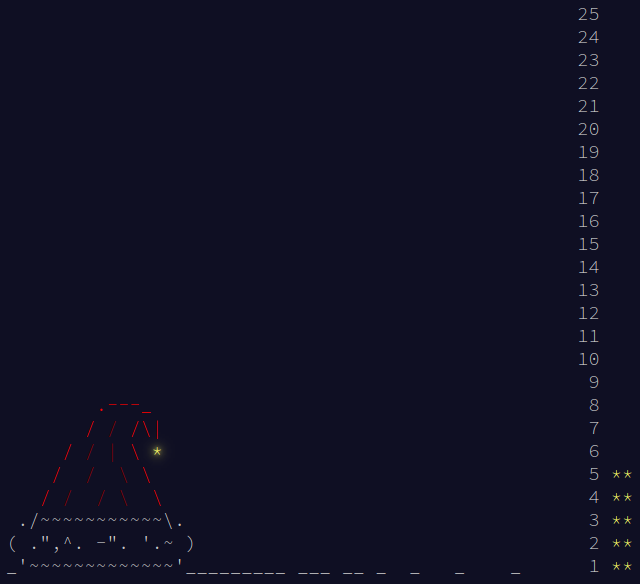

2017:

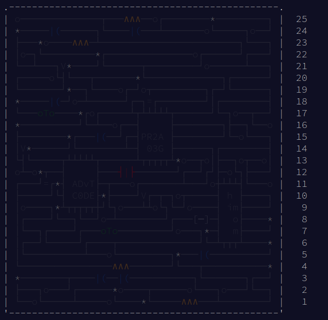

2016:

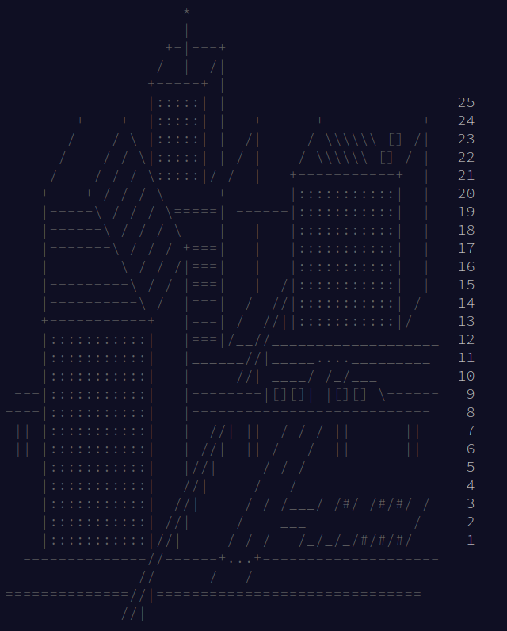

2015:

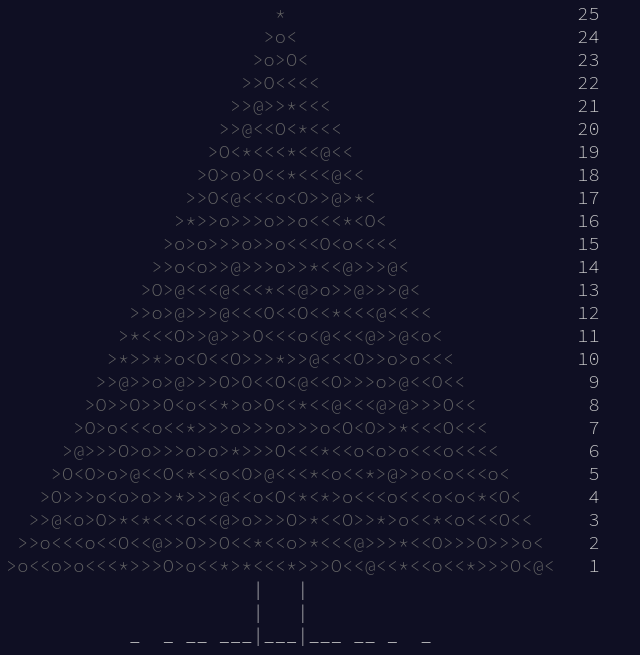
